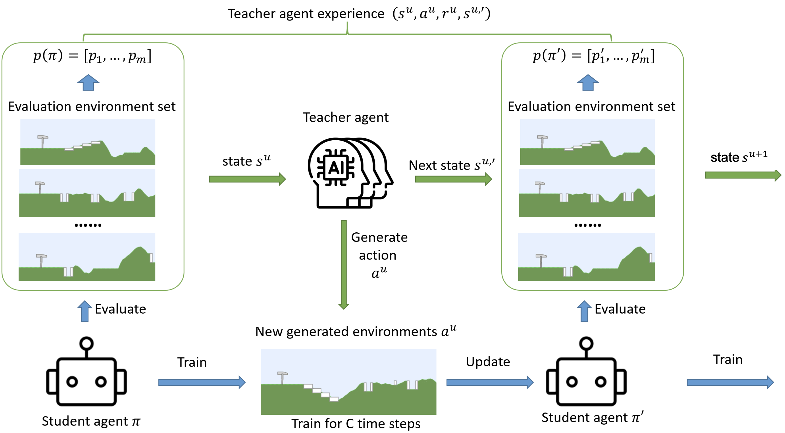

# Efficient Unsupervised Environment Design through Hierarchical Policy Representation Learning

[](https://arxiv.org/pdf/2602.09813)

## 📋 Overview

This repository presents a novel hierarchical MDP framework for **Unsupervised Environment Design (UED)** under resource constraints. Unlike traditional UED approaches that rely on random environment generation, our method employs a teacher-student framework where an upper-level RL teacher agent intelligently generates training environments at the frontier of a lower-level student agent's capabilities.

### Key Features

- 🎯 **Resource-Efficient Training**: Designed for scenarios with limited computational resources and constraints on the number of generated environments
- 🏗️ **Hierarchical Framework**: Two-level MDP structure with teacher and student agents
- 🧠 **Intelligent Curriculum Generation**: Leverages previously discovered environment structures to create progressively challenging scenarios
- 📊 **Trajectory-Based Generation**: Uses generative trajectory modeling to understand and extend student capabilities
- 🚀 **Zero-Shot Transfer**: Trains agents with strong generalization capabilities for unseen environments

## 🔧 Installation

```bash
# Clone the repository
git clone [https://github.com/yourusername/hierarchical-ued-gtm.git](https://github.com/HughLee1994/Efficient-UED-through-Hierarchical-Policy-Representation-Learning)
cd hierarchical-ued-gtm

# Create a virtual environment
conda create -n ued-gtm python=3.9
conda activate ued-gtm

# Install dependencies
pip install -r requirements.txt
```

## 🧩 Hierarchical MDP Architecture

<p align="center">
  <br>
  <em>Figure 1: The overall framework of SHED. SHED uses student’s performance on select evaluation environments as its state to suggest the next appropriate challenge for students to train in.</em>
</p>


## 🏃‍♂️ Run Commands

### 1. **Random Training**:

```bash
python train.py --seed 3407 --num_budget 20 --num_udpates_per_env 50 --buffer_size 10000 --cv False --newMDP False --gamma 1 --domain_randomization True --accel False --cv False --num_env 2 --diffusion_synth_buffer_size 900 --diffusion_lr 1e-3 --diffusion_max_state 200 --use_diffusion False --num_eval_envs 10
```

### 2. **Accel Training**:

```bash
python train.py --seed 3407 --num_budget 20 --num_udpates_per_env 50 --buffer_size 10000 --cv False --newMDP False --gamma 1 --domain_randomization False --accel True --cv False --num_env 2 --diffusion_synth_buffer_size 900 --diffusion_lr 1e-3 --diffusion_max_state 200 --use_diffusion False --num_eval_envs 10
```

### 3. **New MDP Training**:

```bash
python train.py --seed 3407 --num_budget 20 --num_udpates_per_env 50 --buffer_size 10000 --cv False --newMDP True --gamma 1 --domain_randomization False --accel False --cv False --num_env 5 --diffusion_synth_buffer_size 900 --diffusion_lr 1e-3 --diffusion_max_state 200 --use_diffusion False --num_eval_envs 10
```

### 4. **Shed Training**:

```bash
python train.py --seed 3407 --num_budget 20 --num_udpates_per_env 50 --buffer_size 2048 --cv False --newMDP True --gamma 1 --domain_randomization False --accel False --cv False --num_env 5 --diffusion_synth_buffer_size 900 --diffusion_lr 1e-3 --diffusion_max_state 200 --use_diffusion True --num_eval_envs 10
```

## 📖 Citation

If you use this code in your research, please cite:

```bibtex
@article{li2023enhancing,
  title={Enhancing the Hierarchical Environment Design via Generative Trajectory Modeling},
  author={Li, Dexun and Varakantham, Pradeep},
  journal={arXiv preprint arXiv:2310.00301},
  year={2023}
}
```

---
